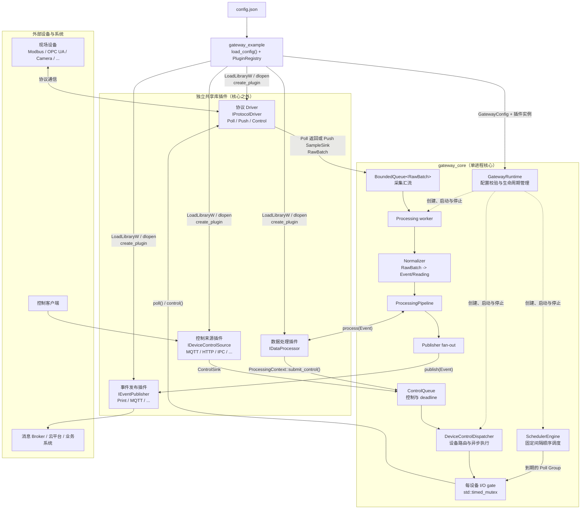

# miniGateway
轻量级的边缘计算网关

目前已经实现：

- Poll 与 Push 两类采集源（模拟）；
- 固定间隔、全局顺序执行的 Poll 调度；
- 统一 `RawBatch -> Event/Reading` 数据模型；
- 通过 `IDataProcessor` 串联规则和推理处理；
- 通过 `IEventPublisher` 输出
- 通过JSON、PluginRegistry 和 LoadLibrary/dlopen 在启动期装配共享库插件

核心只依赖四个抽象接口：
- IProtocolDriver：协议设备产生 RawBatch；
- IDataProcessor：处理或追加 Event 中的 Reading；
- IEventPublisher：把最终 Event 交给外部系统；
- IDeviceControlSource：给device发送控制指令；

## 1. 系统总体框图



实线表示运行期的数据或控制流，虚线表示 `GatewayRuntime` 的生命周期管理关系。Driver、Processor、Publisher 和 ControlSource 的具体实现都位于共享库中；核心只通过四个接口持有和调用它们

## 2. 数据流路径

```text
              Poll Driver shared library                  Push Driver shared library
                        |                                             |
                        |                                             |
SchedulerEngine -> PollCallback -> GatewayRuntime::poll_group         |
                        |                                             |
                        + ------------------ RawBatch ----------------+
                                                |
                                                v
                                   BoundedQueue<RawBatch>
                                                |
                                      processing worker
                                                |
                          Normalizer -> ProcessingPipeline
                                                |
                                      publish_event(Event)
                                                |
                                                |
                                                v                                      
                                       Print Event Publisher 
                                       (test shared library)
```
## 3. 控制流路径
```text
外部 MQTT/HTTP/IPC/...                 Processing worker
          |                                  |
IDeviceControlSource                 IDataProcessor::process
          |                           ProcessingContext::submit_control
          +------------------+---------------+
                             |
                     GatewayRuntime::submit_control
                             |
                     DeviceControlDispatcher
                     -> bounded ControlQueue
                             |
                      control worker (FIFO)
                             |
                    per-device timed_mutex <----- Poll scheduler worker
                             |                     uses same device gate
                    IProtocolDriver::control
                             |
                     ControlCompletion callback
                             |
                    外部协议响应/状态更新
```

## 4. 启动接入插件
插件装配分为四步：

1. [CMakeLists.txt](CMakeLists.txt) 把每个实现编译成独立 `SHARED` 库；可执行程序只链接 `gateway_core`。
2. [config.json](config.json) 为每个插件实例声明 `type`、统一的 `library` 字段和私有 `config`。`library` 必须是带平台后缀的完整库文件名（例如 `.dll` 或 `.so`），可以是相对路径或绝对路径。
3. [PluginRegistry::load_dynamic_plugins()](include/gateway/plugin_registry.hpp) 在 `main()` 启动 Runtime 前一次性调用：Windows 使用 `LoadLibraryW`/`GetProcAddress`，Linux 使用 `dlopen(RTLD_NOW | RTLD_LOCAL)`/`dlsym`。
4. Loader 从每个库解析 `create_plugin(const char*)` 和 `destroy_plugin(void*)`，登记工厂；随后 `PluginRegistry::create()` 按 JSON 顺序创建实例。

每个插件库都通过 [plugin_api.hpp](include/gateway/plugin_api.hpp) 导出同名 C 符号。C ABI 只覆盖入口函数；创建出的对象仍实现 C++ 接口，因此主程序、`gateway_core` 与插件仍应使用 ABI 兼容的编译器和运行库。

## 5. 编写自己的插件

接入真实协议 Driver：

1. 实现 `IProtocolDriver`，根据能力返回 Poll 或 Push；
2. Poll Driver 实现 `poll(group, deadline)`；Push Driver 保存并调用 `SampleSink`；
3. 导出 `extern "C" void* create_plugin(const char*)`，在库内解析私有 JSON 并创建对象；
4. 导出 `extern "C" void destroy_plugin(void*)`，在创建对象的同一库内完成析构和释放；
5. 新建独立 `SHARED` CMake 目标并链接 `gateway_core`；
6. 在 JSON 的 Device 中填写 `driver`、带后缀的 `library` 完整路径和 插件私有`config`（如果插件自身有配置需求的话）。

Processor 和 Publisher 的步骤相同，分别实现 `IDataProcessor` 与 `IEventPublisher`。

## 6. 参考插件样例
| 插件类别 | 核心接口 | 示例共享库 | JSON 配置位置 |
| --- | --- | --- | --- |
| Driver | `IProtocolDriver` | `gateway_poll_simulator`（`simulator_poll`）、`gateway_push_simulator`（`simulator_push`） | `devices[]` 的 `driver/library/driver_config` |
| Processor | `IDataProcessor` | `gateway_threshold_processor`（`threshold`）、`gateway_window_average_processor`（`window_average`）、`gateway_inference_processor`（`inference`） | `processors[]` |
| Event Publisher | `IEventPublisher` | `gateway_print_event_publisher`（`print`） | `event_publishers[]` |
| Device Control Source | `IDeviceControlSource` | `periodic_control_source` | `device_control_sources[]` |

这四类库都只导出相同的 `create_plugin` 和 `destroy_plugin` 两个 C 符号，插件类别由其所在 JSON 配置区决定，实例进入核心后仍通过对应的 C++ 虚接口工作。

## License
The source code of this project is licensed under the MIT License.
This project uses the following third-party dependencies:
- nlohmann/json
- - License: MIT
- - Repository: https://github.com/nlohmann/json.git