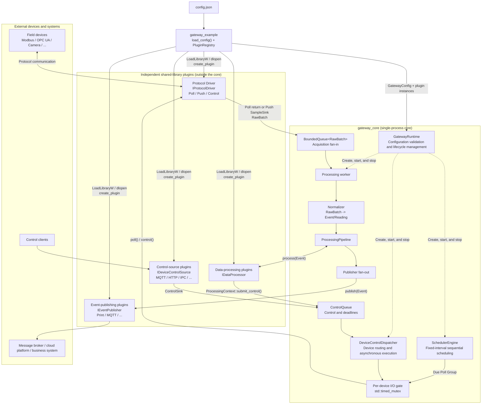

# miniGateway
## ENGLISH | [简体中文](README-zh-CN.md)

A lightweight edge computing gateway.

A lightweight, single-process C++ edge computing gateway with pluggable protocol drivers, configurable data processing and device control, and extensible event publishing through optional MQTT or custom publishers.

Implemented features:

- Supports both Poll and Push data sources;
- Provides fixed-interval Poll scheduling with globally sequential execution;
- Uses a unified `RawBatch -> Event/Reading` data model;
- Chains rule evaluation and inference processing through `IDataProcessor`;
- Publishes output through `IEventPublisher`;
- Uses JSON, `PluginRegistry`, and `LoadLibrary`/`dlopen` to assemble shared-library plugins at startup.

The core depends on only four abstract interfaces:

- `IProtocolDriver`: produces `RawBatch` data from protocol devices;
- `IDataProcessor`: processes an Event or appends Readings to it;
- `IEventPublisher`: delivers the final Event to an external system;
- `IDeviceControlSource`: submits control commands for devices.

## Quick Start

### 1. Default Runtime Configuration

For your first run, use the default configuration for your platform:

- Windows automatically selects `example/configs/defconfig_windows.json`;
- Linux automatically selects `example/configs/defconfig_linux.json`;
- Poll Simulator periodically collects simulated temperature and pressure data;
- Push Simulator actively emits simulated vibration data;
- The Threshold, Window Average, and Inference processors process the collected data;
- Print Event Publisher writes Events and Readings to the terminal;
- Periodic Control Source sends control commands to the two simulators in turn;
- The program stops automatically after approximately `10000 ms` and prints summary statistics.

### 2. Prerequisites

Minimum requirements:

| Item | Requirement |
| --- | --- |
| Operating system | Windows or Linux; macOS is not currently supported |
| CMake | `3.20` or later |
| C++ compiler | MSVC, GCC, or Clang with C++20 support |
| C compiler | C99 support is required only when building Paho MQTT C with `GATEWAY_ENABLE_MQTT=ON`; the default OFF build does not require it |
| Build tool | MinGW Make, Unix Make, or another tool supported by the selected generator |
| External service | None for the default configuration; an MQTT broker is required only when the MQTT Publisher is enabled at runtime |

### 3. Download

```bash
git clone --recursive https://github.com/LRs0ng/miniGateway.git
cd miniGateway
```

or:

```bash
git clone https://github.com/LRs0ng/miniGateway.git
cd miniGateway
git submodule update --init --recursive
```

### 4. Windows + MinGW

From the repository root:

```powershell
mkdir build
cd build
cmake .. -G "MinGW Makefiles"
mingw32-make
```

### 5. Linux

Install the required build tools:

```bash
sudo apt-get update
sudo apt-get install -y build-essential cmake
```

Then build from the repository root:

```bash
mkdir build
cd build
cmake ..
make
```

### 6. Run

#### Windows

```powershell
.\miniGateway.exe
```

#### Linux

```bash
./miniGateway
```

### 7. Enable MQTT

#### Windows

Run the following commands from the repository root:

```powershell
cmake .. -G "MinGW Makefiles" -DGATEWAY_ENABLE_MQTT=ON -DGATEWAY_CONFIG="configs/defconfig_mqtt_windows.json"
```

#### Linux

Run the following commands from the repository root:

```bash
cmake .. -DGATEWAY_ENABLE_MQTT=ON -DGATEWAY_CONFIG="configs/defconfig_mqtt_linux.json"
```

After the build completes, open `example/build/config.json`. The following fragment is the Windows MQTT Publisher entry; the Linux configuration uses `./libgateway_mqtt_event_publisher.so` for `library`.

```json
{
  "id": "mqtt",
  "type": "mqtt",
  "library": "./gateway_mqtt_event_publisher.dll",
  "enabled": false,
  "config": {
    "host": "127.0.0.1",
    "port": 1883,
    "keepalive": 30,
    "client_id": "edge-gateway",
    "topic_prefix": "edge/events",
    "qos": 1,
    "retain": false,
    "clean_session": true,
    "username": "",
    "password": "",
    "reconnect_delay": 1,
    "reconnect_delay_max": 30,
    "reconnect_exponential_backoff": true
  }
}
```

Change `"enabled": false` to `"enabled": true`. Set `host` and `port` to match the MQTT broker, and configure `username` and `password` if authentication is required.

#### Receive MQTT Messages

The program publishes to topics with the following format:

```text
<topic_prefix>/<device_id>/event
```

The JSON configuration sets `topic_prefix` to `edge/events`. To receive data from the virtual `simulator_poll` device, note that its configured device ID is `machine-01`. An MQTT client must therefore subscribe to:

```text
edge/events/machine-01/event
```

## 1. System Architecture



Solid lines represent runtime data or control flows. Dashed lines represent lifecycle relationships managed by `GatewayRuntime`. Concrete Driver, Processor, Publisher, and ControlSource implementations reside in shared libraries; the core owns and invokes them only through the four interfaces.

## 2. Data Flow

```text
              Poll Driver shared library                  Push Driver shared library
                        |                                             |
                        |                                             |
SchedulerEngine -> PollCallback -> GatewayRuntime::poll_group         |
                        |                                             |
                        +------------------- RawBatch ----------------+
                                                |
                                                v
                                   BoundedQueue<RawBatch>
                                                |
                                      processing worker
                                                |
                          Normalizer -> ProcessingPipeline
                                                |
                                      publish_event(Event)
                                                |
                                                v
                                       Print Event Publisher
                                       (test shared library)
```

## 3. Control Flow

```text
External MQTT/HTTP/IPC/...                 Processing worker
          |                                      |
IDeviceControlSource                    IDataProcessor::process
          |                       ProcessingContext::submit_control
          +-------------------+------------------+
                              |
                      GatewayRuntime::submit_control
                              |
                      DeviceControlDispatcher
                      -> bounded ControlQueue
                              |
                       control worker (FIFO)
                              |
                     per-device timed_mutex <----- Poll scheduler worker
                              |                     uses same device gate
                     IProtocolDriver::control
                              |
                      ControlCompletion callback
                              |
                  External protocol response/state update
```

## 4. Loading Plugins at Startup

Plugin assembly consists of four steps:

1. [CMakeLists.txt](CMakeLists.txt) builds each implementation as an independent `SHARED` library. The executable links only against `gateway_core`.
2. `config.json` declares each plugin instance's type (`driver` for devices and `type` for the other plugin categories), common `library` field, and plugin-specific configuration. `library` must contain the complete platform-specific filename, including its `.dll` or `.so` suffix, and may be a relative or absolute path.
3. [PluginRegistry::load_dynamic_plugins()](include/gateway/plugin_registry.hpp) is called once before `main()` starts the Runtime. Windows uses `LoadLibraryW`/`GetProcAddress`; Linux uses `dlopen(RTLD_NOW | RTLD_LOCAL)`/`dlsym`.
4. The loader resolves `create_plugin(const char*)` and `destroy_plugin(void*)` from each library and registers a factory. `PluginRegistry::create()` then creates instances in JSON order.

Every plugin library exports the same two C symbols through [plugin_api.hpp](include/gateway/plugin_api.hpp). The C ABI covers only the entry points; each created object still implements a C++ interface. The main executable, `gateway_core`, and all plugins must therefore use ABI-compatible compilers and runtime libraries.

## 5. Writing Your Own Plugin

To integrate a real protocol Driver:

1. Implement `IProtocolDriver` and report either Poll or Push capability as appropriate.
2. For a Poll Driver, implement `poll(group, deadline)`. For a Push Driver, retain and invoke the supplied `SampleSink`.
3. Export `extern "C" void* create_plugin(const char*)`; parse the plugin-specific JSON and create the object inside the library.
4. Export `extern "C" void destroy_plugin(void*)`; destroy and release the object inside the same library that created it.
5. Add an independent `SHARED` CMake target and link it against `gateway_core`.
6. In the JSON Device entry, set `driver`, the complete `library` path including its suffix, and `driver_config` if the plugin has private configuration.

The process is the same for Processors, Publishers, and ControlSources. Implement `IDataProcessor`, `IEventPublisher`, or `IDeviceControlSource`, respectively.

## 6. Reference Plugin Examples

| Plugin category | Core interface | Example shared library | JSON configuration |
| --- | --- | --- | --- |
| Driver | `IProtocolDriver` | [`gateway_poll_simulator` (`simulator_poll`)](tests/simulation/poll_simulator.cpp), [`gateway_push_simulator` (`simulator_push`)](tests/simulation/push_simulator.cpp) | `driver/library/driver_config` in `devices[]` |
| Processor | `IDataProcessor` | [`gateway_threshold_processor` (`threshold`)](src/processor/threshold_processor.cpp), [`gateway_window_average_processor` (`window_average`)](src/processor/window_average_processor.cpp), [`gateway_inference_processor` (`inference`)](src/processor/inference_processor.cpp) | `processors[]` |
| Event Publisher | `IEventPublisher` | [`gateway_print_event_publisher` (`print`)](tests/simulation/print_event_publisher.cpp) | `event_publishers[]` |
| Device Control Source | `IDeviceControlSource` | [`gateway_periodic_control_source` (`periodic_control`)](tests/simulation/periodic_control_source.cpp) | `device_control_sources[]` |

All four library categories export only the same two C symbols, `create_plugin` and `destroy_plugin`. The JSON section containing a plugin determines its category. Once instantiated, the core accesses each plugin through the corresponding C++ virtual interface.

## License

The source code of this project is licensed under the MIT License.

This project uses the following third-party dependencies:

- nlohmann/json
  - License: MIT
  - Repository: https://github.com/nlohmann/json.git
- eclipse-paho/paho.mqtt.c
  - License: EPL-2.0
  - Repository: https://github.com/eclipse-paho/paho.mqtt.c.git
